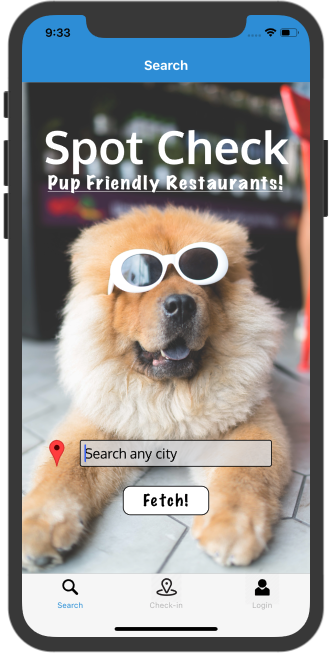
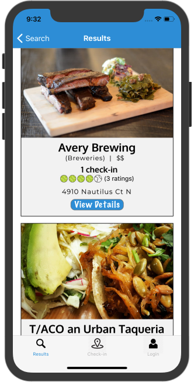
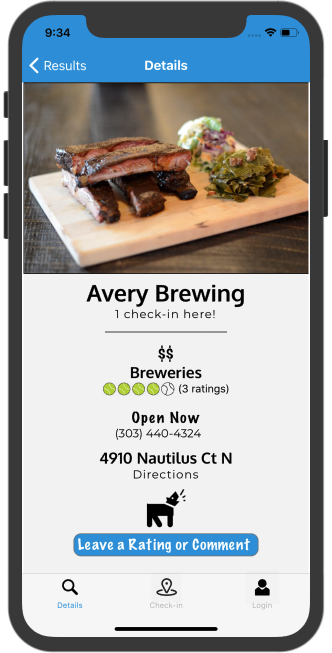
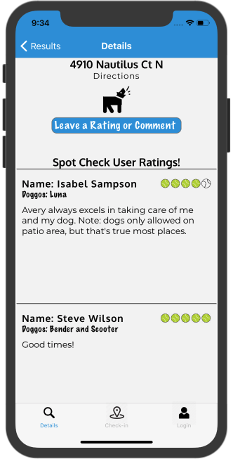
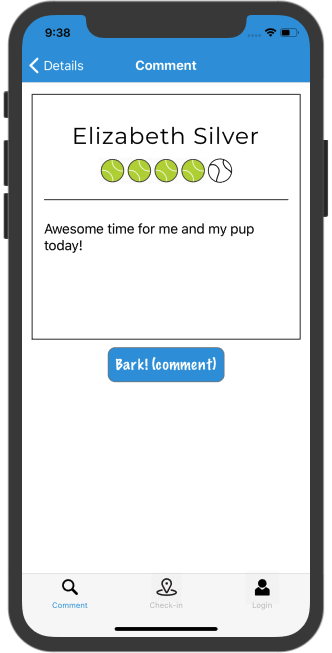
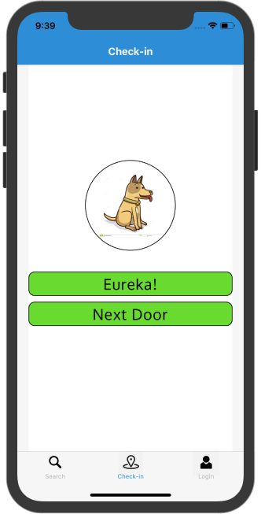
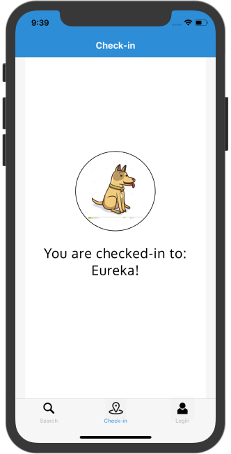
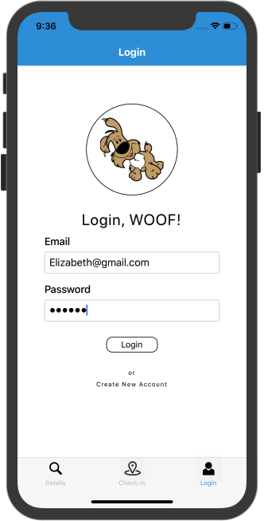
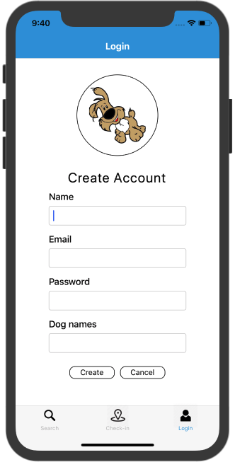
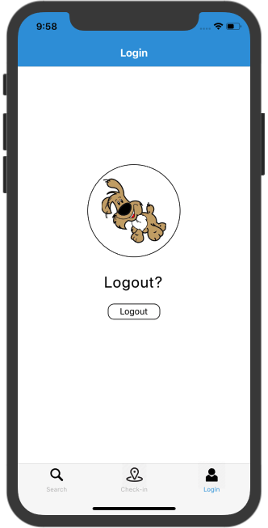

# SpotCheck -- Pup Friendly Restaurants

## About the app

SpotCheck is mobile app that allows the user to find dog-friendly restaurants nearby or through a city search. The app has a social component: users who login may post restaurant reviews and 'check-in' to a location they are in or very close to.

SpotCheck was built with React Native and supports IOS and Android.  The app uses the Yelp api to find dog-friendly restaurants.  The applications backend is in a separate project and deployed to a Heroku server.

## Search

The Search screen allows proximity search or lookup by city name.

## Results

The Results screen is a scrollable list of restaurants with average ratings from other app users (1 to 5 tennis balls) and the number of users who have checked-in to the location.

## Details

Tapping a result leads to the Detail screen with more information on the restaurant and a link to the mobile device's default map.

## Reviews

If the user is logged in they may tap to leave a rating and comments.

## Check-in

If the user is logged in they may check-in to a restaurant based on their current location.  In this example the two restaurants are very close to each other so the app lists both choices.

## Login/out

Basic user management screens.

